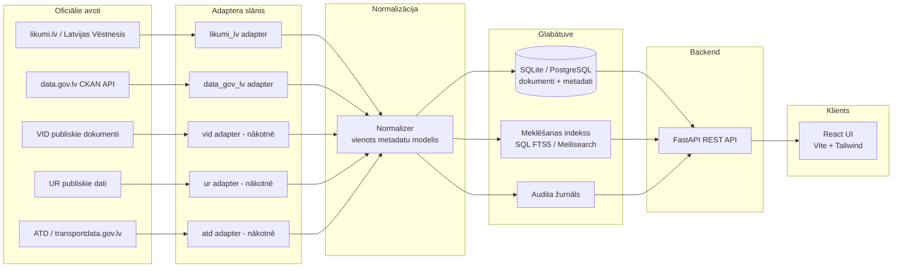
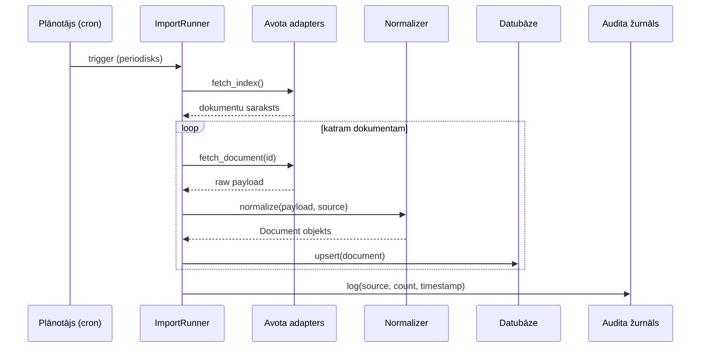
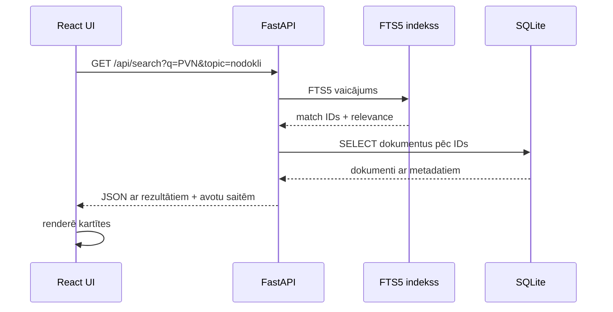

# Sistēmas arhitektūra

## Pārskats

Sistēma ir veidota ar **source connectors → normalization → storage + search index → REST API → UI** principu. Katrs oficiālais avots tiek apstrādāts atsevišķā adapterī, kas ļauj sistēmu paplašināt bez pārbūves.

## Augsta līmeņa diagramma

## Komponenšu apraksts

### 1. Adaptera slānis (`backend/app/adapters/`)

Katrs adapters ievieš vienotu `SourceAdapter` interfeisu ar metodēm:

- `fetch_index()` — iegūst dokumentu sarakstu (indeksa lapu vai API rezultātu)
- `fetch_document(external_id)` — iegūst konkrēta dokumenta pilnu metadatu un saiti
- `get_source_meta()` — atgriež avota nosaukumu, bāzes URL, licenci, pēdējā importa laiku

**MVP adapteri:**

- `likumi_lv.py` — strādā ar [likumi.lv](https://likumi.lv) struktūru. Izmanto polītu rindošanu (rate limiting, `robots.txt` ievērošana). Iegūst metadatus: virsraksts, tips, numurs, pieņemšanas datums, spēkā stāšanās, iestāde, oficiālās publikācijas saite.
- `data_gov_lv.py` — izmanto **CKAN API** no [data.gov.lv](https://data.gov.lv). Galapunkts `/api/3/action/package_search`. Iegūst datu kopas: virsraksts, organizācija, atjaunināšanas datums, licence, resursu saites.

**Nākotnes adapteri** — VID, UR, ATD pievienojami, nepārbūvējot pārējo sistēmu.

### 2. Normalizācijas slānis (`backend/app/normalizer.py`)

Pārveido dažādu avotu izvadi vienā kopīgā modelī:

| Lauks | Tips | Piezīmes |
|---|---|---|
| `external_id` | str | unikāls katram avotam |
| `source` | str | `likumi_lv`, `data_gov_lv`, u.c. |
| `doc_type` | str | `likums`, `mk_noteikumi`, `vadlinijas`, `datu_kopa` |
| `title` | str | oficiālais nosaukums |
| `number` | str? | dokumenta numurs |
| `issuer` | str? | atbildīgā iestāde |
| `adopted_date` | date? | pieņemšanas datums |
| `effective_date` | date? | spēkā stāšanās datums |
| `status` | enum | `speka`, `zaudejis_speku`, `grozits`, `nezinams` |
| `topic` | list[str] | `nodokli`, `gramatvediba`, `logistika` u.c. |
| `official_url` | str | obligāti — saite uz oficiālo publikāciju |
| `license` | str? | ja norādīts avotā |
| `last_imported` | datetime | audita lauks |

### 3. Glabātuve

**MVP:** SQLite + SQLAlchemy. Pietiek līdz ~100k dokumentu. Meklēšana izmanto SQLite FTS5 (pilnteksta indekss).

**Produkcija:** PostgreSQL + Meilisearch vai Elasticsearch. Adaptera slānis un normalizators paliek nemainīgi — maināms tikai glabātuves savienojums.

### 4. Backend API (`backend/app/api/`)

FastAPI REST galapunkti:

- `GET /api/documents` — saraksts ar filtriem (nozare, iestāde, tips, statuss, datums)
- `GET /api/documents/{id}` — viena dokumenta kartīte
- `GET /api/search?q=...` — pilnteksta meklēšana
- `GET /api/topics` — tēmu saraksts
- `GET /api/sources` — avotu saraksts + pēdējā importa laiks (audits)
- `GET /api/documents/{id}/related` — saistītie dokumenti
- `POST /api/import/{source}` — palaiž importu (administratīvi)

Pilna specifikācija: <http://localhost:8000/docs> (Swagger UI).

### 5. Frontend (`frontend/`)

- **React + Vite** — ātra izstrāde un HMR
- **TailwindCSS** — utilīta klases, tumšais režīms
- **React Router** — meklēšanas, kartīšu un tēmu lapas
- **Fetch API** (nav lielu state pārvaldītāju, vienkāršs un rāms)

Galvenās lapas:

- `/` — Dashboard ar tēmu kolekcijām un pēdējiem ierakstiem
- `/search` — meklēšana ar filtriem sānā
- `/document/:id` — dokumenta kartīte ar saiti uz oficiālo avotu
- `/source/:source` — avota apraksts + pēdējā importa statuss
- `/topic/:topic` — tēmas kolekcija

## Plūsma: importēšana

## Plūsma: meklēšana

## Paplašināmība

Lai pievienotu jaunu avotu:

1. Izveido `backend/app/adapters/<jauns_avots>.py` ar `SourceAdapter` interfeisa implementāciju.
2. Reģistrē adapteru `backend/app/adapters/__init__.py` sarakstā.
3. Ja jaunais avots ievieš jaunu `doc_type`, pievieno to normalizatora translācijas tabulā.
4. Palaiž `python import_runner.py --source <jauns_avots>`.

Sistēma nav jāpārbūvē.

## Tehnoloģiju kaudze

| Slānis | Izvēle | Pamatojums |
|---|---|---|
| Backend | Python 3.11 + FastAPI | tipu validācija, automātiskā OpenAPI, ātra izstrāde |
| ORM | SQLAlchemy 2.x | standarta, pāreja uz Postgres bez izmaiņām |
| DB (MVP) | SQLite + FTS5 | zero-setup, iebūvēta pilnteksta meklēšana |
| HTTP klients | httpx | async, moderna alternatīva requests |
| HTML parsēšana | BeautifulSoup + lxml | stabila, plaši izmantota |
| Frontend | React 18 + Vite | standarta, ātra HMR |
| Stili | TailwindCSS | utilīta klases, tumšais režīms |
| Routing | React Router 6 | standarta |

## Drošība un audits

- Katram ierakstam **obligāti** tiek saglabāts `official_url` lauks.
- `last_imported` norāda, kad datus pēdējo reizi atsvaidzināja.
- Audita tabula glabā katru importa reizi: avots, ieguto dokumentu skaits, kļūdas, ilgums.
- Ielasīšana no publiskām HTML lapām ievēro `robots.txt` un polītu rate limiting.
- Nekādu lietotāju datu glabāšana MVP posmā (bez login).
